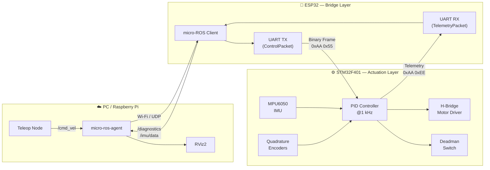

<p align="center">
  <h1 align="center">🤖 TeeterTotter Bot</h1>
  <p align="center">
    <strong>A dual-processor, ROS 2-enabled self-balancing robot</strong><br/>
    <em>Demonstrating real-time control, systems architecture, and embedded protocol design</em>
  </p>
  <p align="center">
    
    
    
    
    
  </p>
</p>

---

## Table of Contents

- [Overview](#overview)
- [System Architecture](#system-architecture)
- [Key Features](#key-features)
- [Hardware BOM](#hardware-bill-of-materials)
- [Repository Structure](#repository-structure)
- [Communication Protocol](#communication-protocol)
- [Getting Started](#getting-started)
- [Safety Features](#safety-features)
- [Contributing](#contributing)
- [License](#license)

---

## Overview

TeeterTotter Bot is a **two-wheeled self-balancing robot** built on a **heterogeneous dual-MCU architecture**. A dedicated **STM32F401** runs the deterministic inner control loop (PID + motor drive) at up to 1 kHz, while an **ESP32** acts as a wireless bridge, exposing the robot to the **ROS 2** ecosystem via [micro-ROS](https://micro.ros.org/).

This separation mirrors how industrial robots are designed — isolating safety-critical real-time control from non-deterministic networking — and allows higher-level features (SLAM, teleoperation, visualization) to be developed independently on a PC or Raspberry Pi.

```
 ┌──────────────────────────────────────────────────────────────────┐
 │                     APPLICATION  LAYER                          │
 │           PC / Raspberry Pi  (ROS 2 Humble)                     │
 │  ┌────────────┐  ┌────────────┐  ┌──────────────────────┐       │
 │  │  Teleop    │  │   RViz2    │  │  micro-ros-agent     │       │
 │  │  Node      │  │  Visualizer│  │  (UDP Bridge)        │       │
 │  └─────┬──────┘  └─────┬──────┘  └──────────┬───────────┘       │
 │        └───────────────┼───────────────────┘                    │
 └────────────────────────┼────────────────────────────────────────┘
                          │  Wi-Fi / UDP
 ┌────────────────────────┼────────────────────────────────────────┐
 │                   BRIDGE  LAYER                                 │
 │                      ESP32                                      │
 │  ┌────────────────┐  ┌──────────────────────────────────┐       │
 │  │ micro-ROS      │  │  UART Bridge                     │       │
 │  │ Client         │  │  (Binary Protocol)               │       │
 │  │ /cmd_vel sub   │  │  TX: ControlPacket               │       │
 │  │ /diag pub      │  │  RX: TelemetryPacket             │       │
 │  └────────┬───────┘  └──────────────┬───────────────────┘       │
 │           └──────────────┬──────────┘                           │
 └──────────────────────────┼──────────────────────────────────────┘
                            │  UART + DMA
 ┌──────────────────────────┼──────────────────────────────────────┐
 │                   ACTUATION  LAYER                              │
 │                     STM32F401                                   │
 │  ┌─────────┐  ┌──────────┐  ┌─────────┐  ┌──────────────────┐  │
 │  │  IMU    │  │   PID    │  │  Motor  │  │  Safety Watchdog │  │
 │  │ MPU6050 │→ │ Balance  │→ │  Driver │  │  (Deadman Switch)│  │
 │  │ (I²C)   │  │ @1 kHz   │  │  (PWM)  │  │  500 ms timeout  │  │
 │  └─────────┘  └──────────┘  └─────────┘  └──────────────────┘  │
 └─────────────────────────────────────────────────────────────────┘
```

---

## System Architecture



---

## Key Features

| Domain | Feature | Detail |
|--------|---------|--------|
| **Real-Time Control** | Deterministic PID loop | FreeRTOS task on STM32F401 Cortex-M4 @ up to 1 kHz |
| **Hardware Acceleration** | FPU-accelerated math | Hard-float compiler flags leverage the M4's hardware FPU |
| **DMA Transfers** | Zero-copy UART | DMA handles byte transfer so the CPU stays on PID math |
| **Wireless ROS 2** | micro-ROS over Wi-Fi | ESP32 dual-core: Core 0 for Wi-Fi/ROS, Core 1 for UART |
| **Binary Protocol** | Custom packed frames | `#pragma pack(1)` structs with start-byte framing & XOR checksum |
| **Fault Tolerance** | Deadman's switch | Motors ramp to zero if no valid packet received within 500 ms |
| **Safety Cutoff** | Tilt watchdog | Automatic motor kill if pitch exceeds ±45° |
| **Modularity** | Shared protocol header | `robot_protocol.h` is compiled on both architectures |

---

## Hardware Bill of Materials

| Component | Part | Role |
|-----------|------|------|
| **Real-Time MCU** | STM32F401 (Black Pill) | PID balance loop, motor control, IMU reading |
| **Wireless MCU** | ESP32-WROOM-32 | micro-ROS client, Wi-Fi bridge, telemetry relay |
| **IMU** | MPU6050 _or_ BMI160 | 6-axis accelerometer + gyroscope for tilt sensing |
| **Motor Driver** | L298N _or_ DRV8833 | Dual H-bridge for bidirectional DC motor control |
| **Motors** | N20 geared DC motors × 2 | Drive wheels with quadrature encoders |
| **Power** | 2S LiPo (7.4 V) | Battery pack with voltage divider for monitoring |
| **Level Shifter** | 3.3 V ↔ 3.3 V (or 5 V) | UART level matching between MCUs |
| **Chassis** | 3D-printed / laser-cut | Custom frame for the two-wheeled platform |

---

## Repository Structure

```
TeeterTotterBot/
│
├── esp32_microros_bridge/            ← PlatformIO project (ESP32)
│   ├── include/
│   │   ├── robot_protocol.h          ← Shared packet definitions
│   │   └── config.h                  ← Wi-Fi credentials & pin map
│   ├── src/
│   │   ├── main.cpp                  ← Entry point & FreeRTOS task setup
│   │   ├── ros_manager.cpp           ← micro-ROS publishers / subscribers
│   │   └── uart_bridge.cpp           ← STM32 serial communication logic
│   ├── lib/
│   │   └── micro_ros_arduino/        ← micro-ROS precompiled library
│   ├── test/                         ← Unit tests for checksum logic
│   └── platformio.ini                ← Build flags & library deps
│
├── stm32_balance_controller/         ← STM32CubeIDE project (STM32F401)
│   ├── Core/
│   │   ├── Inc/
│   │   │   ├── main.h                ← Peripheral & clock config
│   │   │   ├── pid_controller.h      ← PID algorithm interface
│   │   │   ├── robot_protocol.h      ← Shared packet definitions (same file)
│   │   │   └── freertos_tasks.h      ← RTOS task declarations
│   │   └── Src/
│   │       ├── main.c                ← Hardware init (clocks, GPIO, DMA)
│   │       ├── freertos.c            ← FreeRTOS task implementations
│   │       ├── pid_controller.c      ← PID compute logic
│   │       └── stm32f4xx_it.c        ← Interrupt handlers (DMA, Timer)
│   ├── Drivers/                      ← STM32 HAL libraries
│   ├── Middlewares/
│   │   └── Third_Party/FreeRTOS/     ← FreeRTOS kernel source
│   └── STM32F401CCUx_FLASH.ld        ← Linker script (memory map)
│
├── .gitignore
└── README.md                         ← You are here
```

---

## Communication Protocol

Both MCUs share a common `robot_protocol.h` header defining packed binary frames. This ensures identical memory layout across ARM Cortex-M4 (STM32) and Xtensa (ESP32) architectures.

### Command Packet — ESP32 → STM32

Sent at **20–50 Hz** to update the balance controller's velocity setpoints.

| Offset | Size | Field | Value / Range |
|--------|------|-------|---------------|
| 0 | 1 B | `start_byte1` | `0xAA` |
| 1 | 1 B | `start_byte2` | `0x55` |
| 2 | 4 B | `target_linear` | float — m/s |
| 6 | 4 B | `target_angular` | float — rad/s |
| 10 | 1 B | `checksum` | XOR of bytes 0–9 |

**Total: 11 bytes**

### Telemetry Packet — STM32 → ESP32

Sent at **50–100 Hz** to report robot state back to ROS 2.

| Offset | Size | Field | Value / Range |
|--------|------|-------|---------------|
| 0 | 1 B | `start_byte1` | `0xAA` |
| 1 | 1 B | `start_byte2` | `0xEE` |
| 2 | 4 B | `current_pitch` | float — radians |
| 6 | 4 B | `battery_v` | float — volts |
| 10 | 4 B | `left_encoder` | int32 — ticks |
| 14 | 4 B | `right_encoder` | int32 — ticks |
| 18 | 1 B | `checksum` | XOR of bytes 0–17 |

**Total: 19 bytes**

### Checksum Algorithm

```c
uint8_t calculate_checksum(uint8_t *data, size_t len) {
    uint8_t crc = 0;
    for (size_t i = 0; i < len; i++) {
        crc ^= data[i];
    }
    return crc;
}
```

---

## Getting Started

### Prerequisites

| Tool | Purpose | Install |
|------|---------|---------|
| [PlatformIO CLI](https://platformio.org/) | Build & flash ESP32 firmware | `pip install platformio` |
| [STM32CubeIDE](https://www.st.com/en/development-tools/stm32cubeide.html) | Build & flash STM32 firmware | ST website |
| [ROS 2 Humble](https://docs.ros.org/en/humble/) | Application layer | [Install guide](https://docs.ros.org/en/humble/Installation.html) |
| [micro-ros-agent](https://github.com/micro-ROS/micro-ROS-Agent) | UDP ↔ DDS bridge | `ros2 run micro_ros_agent micro_ros_agent udp4 --port 8888` |

### 1. Build & Flash the ESP32

```bash
cd esp32_microros_bridge

# Edit Wi-Fi credentials
nano include/config.h

# Build and upload
pio run --target upload

# Monitor serial output
pio device monitor
```

### 2. Build & Flash the STM32

1. Open `stm32_balance_controller/` in **STM32CubeIDE**
2. Ensure compiler flags include `-mfloat-abi=hard -mfpu=fpv4-sp-d16`
3. Build the project → flash via ST-Link or USB DFU

### 3. Launch ROS 2 Agent

```bash
# Terminal 1 — Start the micro-ROS agent
ros2 run micro_ros_agent micro_ros_agent udp4 --port 8888

# Terminal 2 — Send velocity commands
ros2 topic pub /cmd_vel geometry_msgs/msg/Twist \
  "{linear: {x: 0.1}, angular: {z: 0.0}}"

# Terminal 3 — Monitor telemetry
ros2 topic echo /diagnostics
```

---

## Safety Features

| Feature | Trigger | Action |
|---------|---------|--------|
| **Deadman's Switch** | No valid packet received for > 500 ms | Ramp motors to zero |
| **Tilt Cutoff** | Pitch exceeds ±45° | Immediate motor kill |
| **Watchdog Timer** | MCU hangs or crashes | Hardware reset via IWDG |
| **Packet Validation** | Start bytes or checksum mismatch | Packet silently dropped |

---

## Contributing

1. Fork the repository
2. Create a feature branch (`git checkout -b feature/kalman-filter`)
3. Commit your changes (`git commit -m "feat: add Kalman filter for IMU fusion"`)
4. Push to the branch (`git push origin feature/kalman-filter`)
5. Open a Pull Request

---

## License

This project is licensed under the **MIT License** — see [LICENSE](LICENSE) for details.

---

<p align="center">
  <sub>Built with ❤️ for robotics — designed to demonstrate <strong>systems engineering</strong>, <strong>real-time control</strong>, and <strong>distributed embedded architecture</strong>.</sub>
</p>
